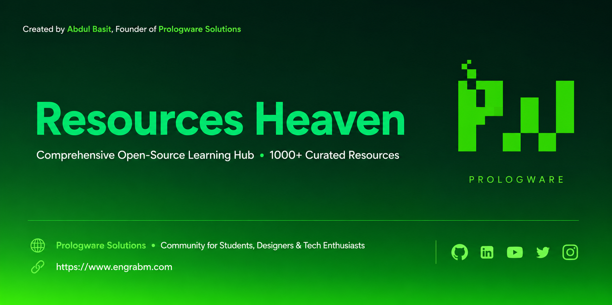

# Resources Heaven

A curated open-source knowledge hub by [Prologware Solutions](https://prologware-solutions.hashnode.dev/) | Maintained by [Abdul Basit Memon](https://engrabm.com)

## Overview

Resources Heaven is a comprehensive, community-maintained collection of learning resources spanning technology, design, business, and professional development. This repository serves as a centralized discovery point for 1,000+ hand-picked tools, platforms, and guides.

**Website:** [resources-heaven.super.site](https://resources-heaven.super.site/)

## Resource Categories

| Category | Resource File | Description |
|----------|---------------|-------------|
| Learning Platforms | [LearningSites.md](LearningSites.md) | 100+ curated online learning platforms (MOOCs, courses, tutorials) |
| AI Learning Tools | [ai-Learning_tools.md](ai-Learning_tools.md) | AI-powered educational tools and personalized learning assistants |
| Research Tools | [Research_tools.md](Research_tools.md) | Academic research tools for discovery, citation, and publication |
| Image Generators | [image_generators.md](image_generators.md) | AI image generation models, tools, and design platforms |
| UI Generators | [UI-Generators.md](UI-Generators.md) | AI-powered UI/UX design and code generation tools |
| Video Generators | [Video_Generators.md](Video_Generators.md) | AI video creation, editing, and animation platforms |
| Animation Tools | [annimation_Motion_generators.md](annimation_Motion_generators.md) | Motion graphics and animation creation tools |
| Presentation Tools | [presentation_generators.md](presentation_generators.md) | AI-powered presentation and slide generation platforms |
| Vibe Coding Tools | [vibe_coding_tools.md](vibe_coding_tools.md) | Agentic development tools and workflow resources |
| Vibe Coding Guide | [vibecoding_guide.md](vibecoding_guide.md) | Comprehensive guide to AI-assisted software development |

## Guides

Located in [Guides/](Guides/):

- **[A Beginner's Guide to Academic Research](Guides/A%20Beginner's%20Guide%20to%20Academic%20Research_%20Pipeline,%20Tools,%20and%20Best%20Practices.md)** — Complete research pipeline covering discovery, mapping, synthesis, data collection, analysis, writing, and publishing workflows
- **[Vibe Coding Workflow Guide](Guides/Vibe%20Coding%20Workflow%20Guide.md)** — Agentic development best practices for modern AI-assisted programming

## Using This Repository

### For Learners
1. Browse resource categories above to find tools matching your interests
2. Open the corresponding markdown file for detailed listings
3. Click through to access learning platforms, tools, or reference materials

### For Contributors
1. Fork the repository
2. Create a feature branch (`git checkout -b feature/add-resource`)
3. Add resources following existing markdown formatting conventions
4. Ensure proper categorization and working links
5. Commit and push changes
6. Open a pull request

## Contribution Guidelines

- Place only actual guides in the `Guides/` directory
- Maintain consistent markdown table formatting across resource files
- Include resource name, URL, description, and relevant tags/categories
- Verify all links are functional before submitting
- Add brief descriptions that accurately represent each resource

## License

Open source. Contributions are recommended under the [MIT License](https://choosealicense.com/licenses/mit/).

## Connect

- **Website:** [resources-heaven.super.site](https://resources-heaven.super.site/)
- **GitHub:** [@abm1119](https://github.com/abm1119)
- **LinkedIn:** [Abdul Basit Memon](https://pk.linkedin.com/in/abdul-basit-memon-614961166)

---

*Keywords: learning resources, AI tools, online courses, research tools, educational platforms, open source, free resources, professional development, technology learning, design tools*